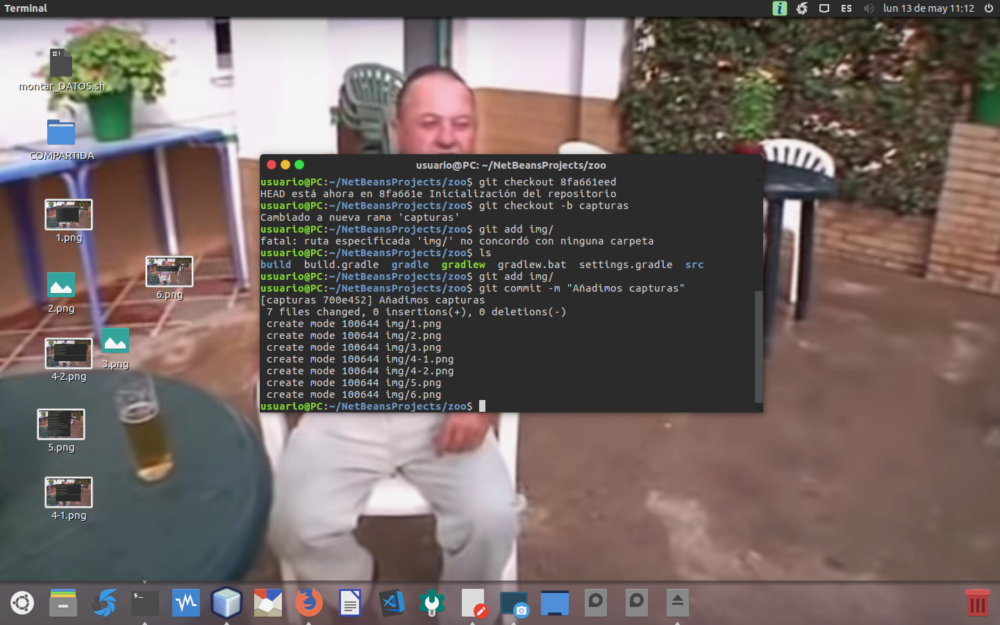

# PRUEBA DE DOCUMENTACIÓN, OPTIMIZACIÓN Y CONTROL DE VERSIONES
***Mateo Fortea Dugo***
*13 de Mayo de 2019*

## EJERCICIO 1

## EJERCICIO 2

## EJERCICIO 3

*Los comandos aparecen en el terminal separados por ; debido a que perdí la captura*

## EJERCICIO 4

*Los comandos aparecen en el terminal separados por ; debido a que perdí la captura*

## EJERCICIO 5

## EJERCICIO 6

## EJERCICIO 7

